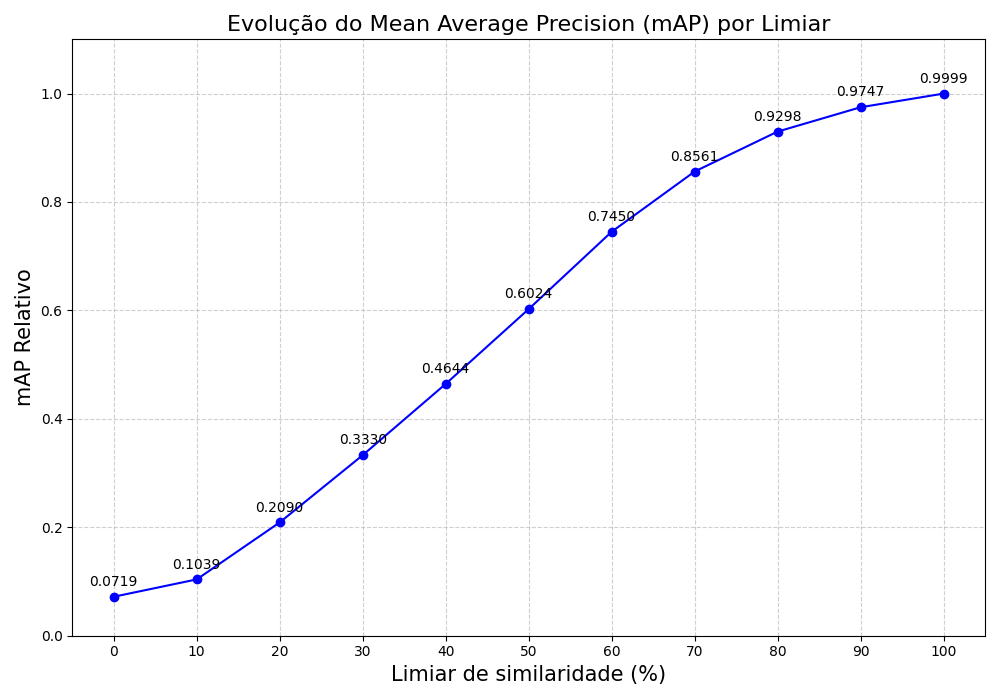

# LWPDA: Um Algoritmo Leve para Detecção de Diferença Perceptual em Vídeos


Este repositório apresenta o **LWPDA (Lightweight Perceptual Difference Algorithm)**, um novo algoritmo de baixo custo computacional para medir a similaridade visual entre quadros de vídeo. O projeto inclui um framework de testes completo para comparar a performance do LWPDA com outros métodos de referência, como SSIM, MSE, Image Hashing e Histogramas.

Desenvolvido pelo Grupo de Teleinformática e Automação (GTA) da UFRJ.

Autor: Hugo Leandro Anteuns (antunes@gta.ufrj.br / https://www.gta.ufrj.br/~antunes/)

Orientadores: 
- Rodrigo de Souza Couto (rodrigo@gta.ufrj.br) 
- Pedro Henrique Cruz (cruz@gta.ufrj.br)
- Luis Kosmalski (luish@gta.ufrj.br)

---

## Tabela de Conteúdos
- [O Problema](#o-problema)
- [A Solução: O Algoritmo LWPDA](#a-solução-o-algoritmo-lwpda)
- [Funcionalidades do Repositório](#funcionalidades-do-repositório)
- [Resultados Comparativos](#resultados-comparativos)
- [Começando](#começando)
  - [Pré-requisitos](#pré-requisitos)
  - [Instalação](#instalação)
- [Como Usar](#como-usar)
- [Métodos de Comparação (Baselines)](#métodos-de-comparação-baselines)
- [Licença](#licença)
- [Agradecimentos](#agradecimentos)

---

## O Problema

Em sistemas de vigilância e análise de vídeo, o processamento contínuo de cada quadro com modelos de detecção de objetos (como o YOLO) é computacionalmente intensivo e, muitas vezes, redundante. Cenas estáticas ou com pouca movimentação geram uma grande quantidade de quadros visualmente similares, cujo processamento completo consome recursos desnecessariamente.

## A Solução: O Algoritmo LWPDA

Para resolver essa questão, propomos o **LWPDA**, um algoritmo projetado para ser uma primeira camada de filtragem rápida e eficiente. Ele compara quadros consecutivos e determina se a mudança visual entre eles é significativa o suficiente para justificar o acionamento de análises mais pesadas.

#### Vantagens
-   **Leve e Rápido**: Projetado para ter baixa latência e overhead computacional mínimo.
-   **Eficaz**: Capaz de discernir entre mudanças triviais e eventos relevantes no vídeo.
-   **Customizável**: Permite o ajuste de um limiar de similaridade para adaptar a sensibilidade do filtro.

---

## Funcionalidades do Repositório

-   **Implementação do LWPDA**: O código-fonte completo do algoritmo proposto.
-   **Framework de Comparação**: Um ambiente de testes robusto para executar e avaliar o LWPDA contra outros quatro algoritmos de referência.
-   **Análise de Performance**: Scripts para medir métricas essenciais, como tempo de processamento (latência) e distribuição (CDF, P95).
-   **Geração Automática de Gráficos**: Ferramentas para criar visualizações comparativas de performance, facilitando a análise dos resultados.

---

## Resultados LWPDA e Segmentação (yolov8n-seg)

Os gráficos gerados demonstram a eficiência do LWPDA em comparação com os métodos de referência e o custo de processar todos os frames com YOLO.

**1. CDF (Função de Distribuição Cumulativa) do Tempo de Processamento**
Este gráfico ilustra a velocidade do LWPDA para segmentação de objetos em realação ao YOLO sem a utilização do LWPDA.


**2. Performance vs. Limiar de Similaridade**
Aqui, comparamos o tempo de processamento em diferentes limiares. O gráfico mostra que o LWPDA pode ajudar reduzir o tempo de processamento.


**3. Precisão vs. Limiar de Similaridade**
Este mostra a precisão da segmentação quando utilizado o LWPDA.

---

## Começando

Siga estas instruções para configurar o ambiente e executar os testes.

### Pré-requisitos
-   Python 3.8+
-   Pip (Gerenciador de pacotes do Python)

### Instalação
1.  **Clone o repositório:**
    ```bash
    git clone [https://github.com/GTA-UFRJ/LWPDA.git](https://github.com/GTA-UFRJ/LWPDA.git)
    ```
2.  **Navegue até o diretório do projeto:**
    ```bash
    cd LWPDA
    ```
3.  **Crie e ative um ambiente virtual (recomendado):**
    ```bash
    python -m venv venv
    source venv/bin/activate  # No Windows: venv\Scripts\activate
    ```
4.  **Instale as dependências a partir do `requirements.txt`:**
    ```bash
    pip install -r requirements.txt
    ```

---